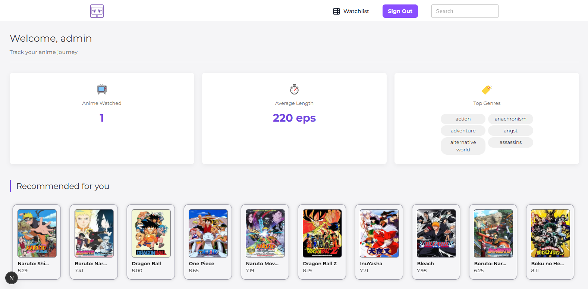
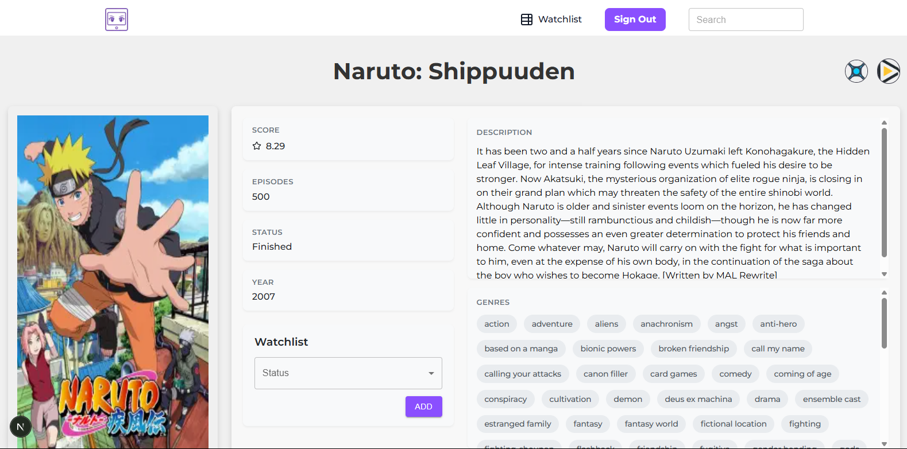

# Anirra

Anirra is a completely self-hosted anime watchlist, search, and recommendations app. It allows anime enthusiasts to manage their watchlists, discover new anime, and receive personalized recommendations, all from a single platform.

## Features

- **Watchlist Management**: Keep track of the anime you plan to watch, are currently watching, or have completed.
- **Search Functionality**: Easily search for anime by title or tags.
- **Personalized Recommendations**: Get suggestions based on your watchlist and preferences.
- **Integration with Sonarr and Radarr**: Seamlessly add series and movies to your media server.
- **Convert your MAL list**: Upload your MAL XML file from [MAL XML Exporter](https://myanimelist.net/panel.php?go=export), and easily move to using Anirra.

## Screenshots

To give you a better idea of what Anirra looks like, here are some screenshots of the app in action:

### Main Page (Logged In)


### Anime Page


### Search Page


### Watchlist Page


### Sonarr Integration


### Radarr Integration


## Launching the App

To launch the app, use the `docker-compose.yml` file located in the root directory of the project. Ensure you have `make` and `docker` installed, then run the following command in your terminal:

```bash
make pull up
```

### Default User Credentials

The default user credentials are:

```
user: admin
password: admin
```

But if you would like to, you can create a new user with a more secure password.

## Configuration

There are a few set of environment variables you can use to customize the app (all are completely optional). 

```
APP_MODE=(DEV || PROD) # defaults to PROD in the docker-compose.yml
DATABASE_URL=whatever you want here if you don't want to use the sqlite database that the app comes with
JSON_DATA_PATH=wherever the `anime_offline_database.json` is located, by default its at /data
JWT_SECRET=a secret used to encode the user jwt
API_URL=if you somehow got the api to run anywhere else
NEXTAUTH_SECRET=a secret used to encode the next jwt
```

### Sonarr and Radarr configuration

Setup the `config.yaml` at the root of the project:

```yaml
sonarr:
  url: http://<ip_or_address>:<port>
  api_key: 123456

radarr:
  url: http://<ip_or_address>:<port>
  api_key: 123456
```

## Coming Soon

- **Mobile Support**: Simplified UI for mobile viewing
- **Watchlist Rating**: Rate the anime and get better recommendations based off of what you like
- **Jellyfin Integration**: Automatically sync the anime you are watching on Jellyfin
